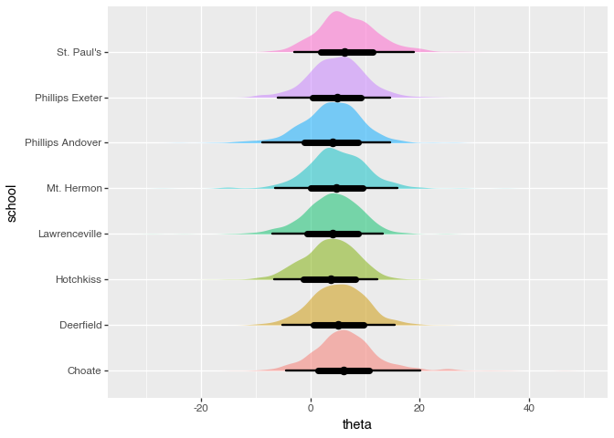
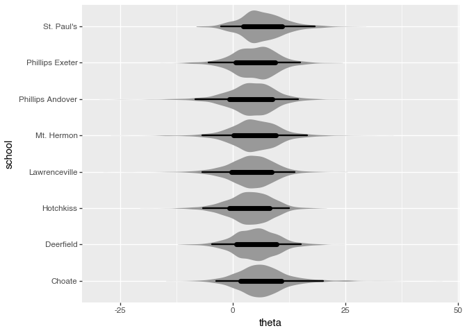
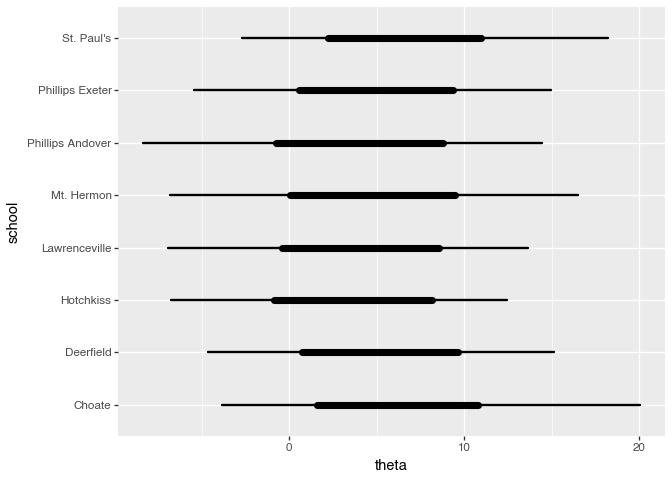
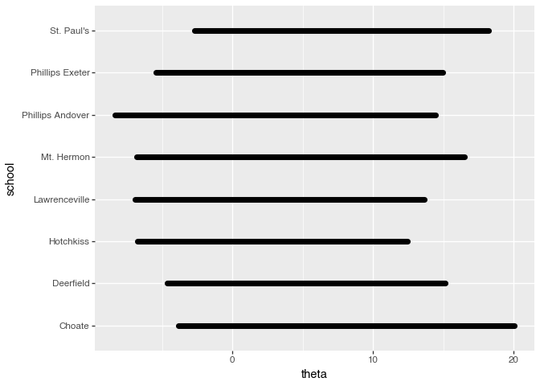
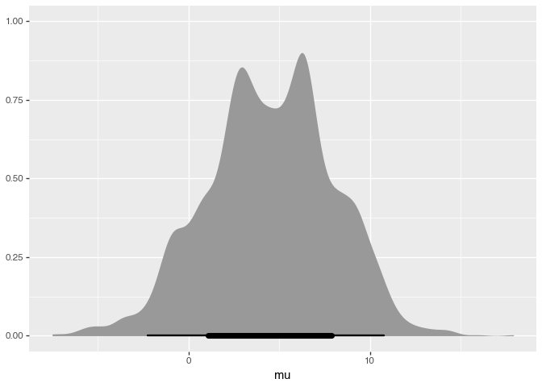
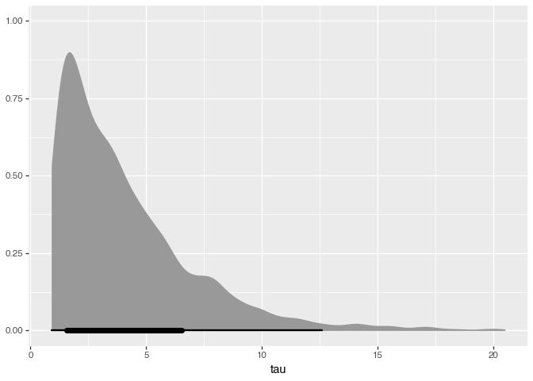

# Tidy Bayesian Analysis, in Python

This package is to help data wrangling with `arviz.InferenceData` objects, in the flavor of [tidybayes](https://mjskay.github.io/tidybayes/index.html).

All of the dataframes are polars, some of the geom functions convert to pandas internally where required.

``` python
import arviz as az
import bayestidy as bt
from plotnine import *
```

## Load data

ArviZ ships pre-fitted models. The “eight schools” dataset has a
hierarchical model with school-level effects `theta`, a shared mean
`mu`, and scale `tau`.

``` python
data = az.load_arviz_data("centered_eight")
```

## Extract tidy draws

`spread_draws` gives one row per draw, with index columns for array
parameters.

``` python
draws = bt.spread_draws(data, "theta[school]", "mu", "tau")
draws.head(10)
```

<div><style>
.dataframe > thead > tr,
.dataframe > tbody > tr {
  text-align: right;
  white-space: pre-wrap;
}
</style>
<small>shape: (10, 6)</small>

| .chain | .draw | school             | theta     | mu       | tau      |
|--------|-------|--------------------|-----------|----------|----------|
| i64    | i64   | str                | f64       | f64      | f64      |
| 0      | 0     | "Choate"           | 12.320686 | 7.871796 | 4.72574  |
| 0      | 0     | "Deerfield"        | 9.905367  | 7.871796 | 4.72574  |
| 0      | 0     | "Phillips Andover" | 14.951615 | 7.871796 | 4.72574  |
| 0      | 0     | "Phillips Exeter"  | 11.011485 | 7.871796 | 4.72574  |
| 0      | 0     | "Hotchkiss"        | 5.579602  | 7.871796 | 4.72574  |
| 0      | 0     | "Lawrenceville"    | 16.901795 | 7.871796 | 4.72574  |
| 0      | 0     | "St. Paul's"       | 13.198059 | 7.871796 | 4.72574  |
| 0      | 0     | "Mt. Hermon"       | 15.061366 | 7.871796 | 4.72574  |
| 0      | 1     | "Choate"           | 11.285623 | 3.384554 | 3.908994 |
| 0      | 1     | "Deerfield"        | 9.129324  | 3.384554 | 3.908994 |

</div>

`gather_draws` gives long format — handy for comparing variables.

``` python
long = bt.gather_draws(data, "mu", "tau")
long.head(10)
```

<div><style>
.dataframe > thead > tr,
.dataframe > tbody > tr {
  text-align: right;
  white-space: pre-wrap;
}
</style>
<small>shape: (10, 4)</small>

| .chain | .draw | .variable | .value    |
|--------|-------|-----------|-----------|
| i64    | i64   | str       | f64       |
| 0      | 0     | "mu"      | 7.871796  |
| 0      | 1     | "mu"      | 3.384554  |
| 0      | 2     | "mu"      | 9.100476  |
| 0      | 3     | "mu"      | 7.304293  |
| 0      | 4     | "mu"      | 9.879675  |
| 0      | 5     | "mu"      | 7.042032  |
| 0      | 6     | "mu"      | 10.378469 |
| 0      | 7     | "mu"      | 10.060016 |
| 0      | 8     | "mu"      | 10.425308 |
| 0      | 9     | "mu"      | 10.810782 |

</div>

## Point estimates and intervals

``` python
bt.median_qi(draws, "theta", by="school", width=[0.66, 0.95])
```

<div><style>
.dataframe > thead > tr,
.dataframe > tbody > tr {
  text-align: right;
  white-space: pre-wrap;
}
</style>
<small>shape: (16, 7)</small>

| school             | theta    | .lower    | .upper    | .width | .point   | .interval |
|--------------------|----------|-----------|-----------|--------|----------|-----------|
| str                | f64      | f64       | f64       | f64    | str      | str       |
| "Choate"           | 6.08171  | 1.590788  | 10.787866 | 0.66   | "median" | "qi"      |
| "Choate"           | 6.08171  | -3.812485 | 20.063309 | 0.95   | "median" | "qi"      |
| "Deerfield"        | 5.010779 | 0.729276  | 9.639297  | 0.66   | "median" | "qi"      |
| "Deerfield"        | 5.010779 | -4.64327  | 15.12579  | 0.95   | "median" | "qi"      |
| "Phillips Andover" | 4.226613 | -0.755306 | 8.81296   | 0.66   | "median" | "qi"      |
| …                  | …        | …         | …         | …      | …        | …         |
| "Lawrenceville"    | 4.136356 | -6.912898 | 13.661674 | 0.95   | "median" | "qi"      |
| "St. Paul's"       | 6.065121 | 2.223271  | 10.942636 | 0.66   | "median" | "qi"      |
| "St. Paul's"       | 6.065121 | -2.676971 | 18.19456  | 0.95   | "median" | "qi"      |
| "Mt. Hermon"       | 4.705673 | 0.040535  | 9.463309  | 0.66   | "median" | "qi"      |
| "Mt. Hermon"       | 4.705673 | -6.781987 | 16.494705 | 0.95   | "median" | "qi"      |

</div>

``` python
bt.median_qi(draws, "mu", width=[0.66, 0.95])
```

<div><style>
.dataframe > thead > tr,
.dataframe > tbody > tr {
  text-align: right;
  white-space: pre-wrap;
}
</style>
<small>shape: (2, 6)</small>

| mu       | .lower    | .upper    | .width | .point   | .interval |
|----------|-----------|-----------|--------|----------|-----------|
| f64      | f64       | f64       | f64    | str      | str       |
| 4.547775 | 1.099583  | 7.872792  | 0.66   | "median" | "qi"      |
| 4.547775 | -2.260603 | 10.746161 | 0.95   | "median" | "qi"      |

</div>

## Half-eye plots

The flagship visualization — density slab + point + intervals, directly
from raw draws.

``` python
(
    ggplot(draws, aes(x="theta", y="school", fill="school"))
    + bt.stat_halfeye(alpha=0.5)
    + labs(x="theta", y="school")
)
```



## Eye plots

Mirrored density (violin-style) + point + intervals.

``` python
(
    ggplot(draws, aes(x="theta", y="school"))
    + bt.stat_eye()
    + labs(x="theta", y="school")
)
```



## Point-interval plots

Just the point estimate and nested credible intervals, no density.

``` python
(
    ggplot(draws, aes(x="theta", y="school"))
    + bt.stat_pointinterval()
    + labs(x="theta", y="school")
)
```


## Interval plots

Nested intervals only.

``` python
(
    ggplot(draws, aes(x="theta", y="school"))
    + bt.stat_interval()
    + labs(x="theta", y="school")
)
```



## Pre-summarized data with geom_pointinterval

If you’ve already computed summaries with `point_interval`, use the geom
variants directly.

``` python
summary = bt.median_qi(draws, "theta", by="school", width=[0.66, 0.95])
summary
```

<div><style>
.dataframe > thead > tr,
.dataframe > tbody > tr {
  text-align: right;
  white-space: pre-wrap;
}
</style>
<small>shape: (16, 7)</small>

| school             | theta    | .lower    | .upper    | .width | .point   | .interval |
|--------------------|----------|-----------|-----------|--------|----------|-----------|
| str                | f64      | f64       | f64       | f64    | str      | str       |
| "Choate"           | 6.08171  | 1.590788  | 10.787866 | 0.66   | "median" | "qi"      |
| "Choate"           | 6.08171  | -3.812485 | 20.063309 | 0.95   | "median" | "qi"      |
| "Deerfield"        | 5.010779 | 0.729276  | 9.639297  | 0.66   | "median" | "qi"      |
| "Deerfield"        | 5.010779 | -4.64327  | 15.12579  | 0.95   | "median" | "qi"      |
| "Phillips Andover" | 4.226613 | -0.755306 | 8.81296   | 0.66   | "median" | "qi"      |
| …                  | …        | …         | …         | …      | …        | …         |
| "Lawrenceville"    | 4.136356 | -6.912898 | 13.661674 | 0.95   | "median" | "qi"      |
| "St. Paul's"       | 6.065121 | 2.223271  | 10.942636 | 0.66   | "median" | "qi"      |
| "St. Paul's"       | 6.065121 | -2.676971 | 18.19456  | 0.95   | "median" | "qi"      |
| "Mt. Hermon"       | 4.705673 | 0.040535  | 9.463309  | 0.66   | "median" | "qi"      |
| "Mt. Hermon"       | 4.705673 | -6.781987 | 16.494705 | 0.95   | "median" | "qi"      |

</div>

``` python
(
    ggplot(summary, aes(x="theta", xmin=".lower", xmax=".upper", y="school"))
    + bt.geom_pointinterval()
    + labs(x="theta", y="school")
)
```



## Scalar parameters

``` python
scalars= draws.select("mu", "tau")

(
    ggplot(scalars, aes(x="mu"))
    + bt.stat_halfeye()
    + labs(x="mu")
)
```



``` python
(
    ggplot(scalars, aes(x="tau"))
    + bt.stat_halfeye()
    + labs(x="tau")
)
```


